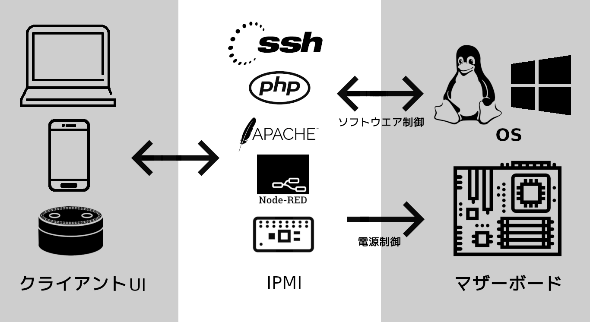
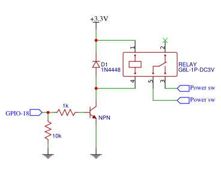
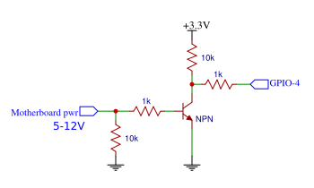
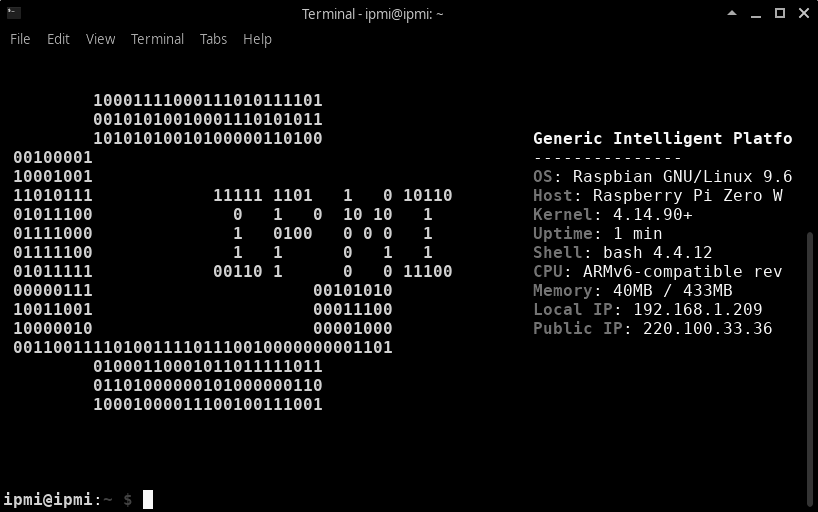
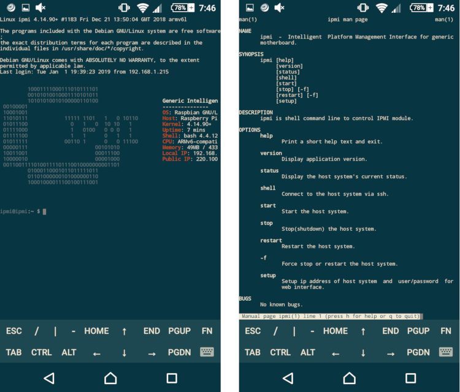
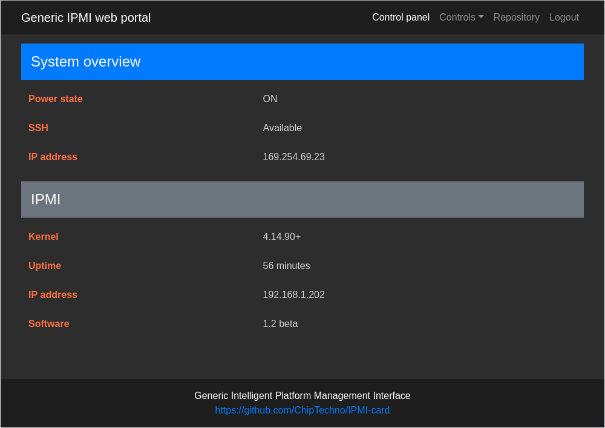
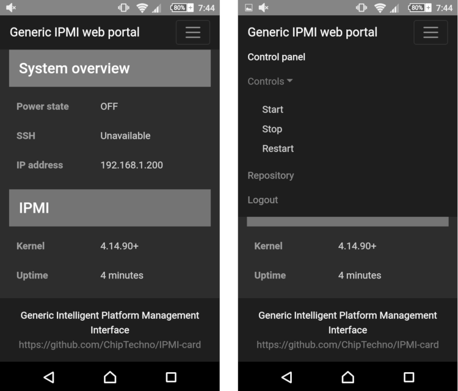
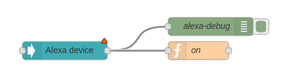

# PC遠隔制御(IPMI)カードの構築
## 1 はじめに
IPMIとはサーバのCPU、バス、ファン、温度センサ、電源、ファンなどの基本コンポーネントの監視や遠隔制御などを行うためのインターフェースである。しかし、市販のIPMIカードは特定のサーバマザーボードにしか対応しない。
本研究では一般ザーボードに対応できるIPMIモジュールを構築する。
## 2 システム構成

図1．システム構成図

- クライアントUI   
クライアントはスマホ、パソコンなどの端末でSSH、又はHttpプロトコルによってサーバーとデータをやり取りする。データの内容はホストPCの電源状態、IPMIモジュールの接続状態、ホストPCに実行させたい命令、命令実行の結果。
- IPMI   
IPMIモジュールはホストPCと独立の電源を使用、マザーボードの電源スイッチを物理的に操作することによって、ホストPCの電源状態と関係なく制御することができる。また、IPMIモジュールはUSBネットワークインタフェースとしてホストPCに接続することで、ホストPCがネットワークに接続しない状態でも遠隔操作ができる。
Apache+Php（ウエブサーバー）でクライアント端末にウエブインタフェースを提供する。スマートスピーカに関する処理はNode-redで行う。
使用可能なインタフェース：SSH,ウエブ
- ホストPC   
ホストPCはSSHプロトコルでIPMIモジュールから命令を受取、命令の実行結果をIPMIモジュールに送る。
## 3 ハードウェア制御
### 3.1 電源スイッチ制御回路

図2．電源制御回路図

Raspberry Zero W GPIOの出力電力が低く、直接リレーを制御できないため、NPNトランジスタスイッチ回路リレーを制御する。リレーは電源スイッチと並列に接続する。
### 3.1 電源状態監視回路

図3．電源監視回路図

マザーボードによって、電源を切ったときにも５Vバースに電源が供給される場合があるため。5VバースでホストPCの電源状態を判定できないときは12VバースでホストPCの電源状態を判定する。Raspberry Zeroの最大入力可能電圧は3.3Vのため、直接5v、12Vバースに直接接続せず、NPNトランジスタスイッチ回路で電源状態の判定を行う。
## 4 ソフトウェア制御
### 4.1 コマンドラインインターフェース(CLI)
ホストPCを遠隔操作するためにSSHプロトコルを利用する。ipmiモジュールにインストールされたipmiツールでほすとPCの電源やソフトウエア制御を行う。　　　
使用可能なコマンドライン:
- start/stop/restart : ホストPCの物理的の電源制御(電源入/切/再起動)。
- status : ホストPCの状態を表示する。
- setup : ipmiモジュールの設定を行う。ホストPCをアクセスためのIPアドレスやWebインターフェースアクセスためのパスワードを変更することができる。
- shell : ホストPCのソフトウェア制御を行う。ホストPCがWindowsの場合はPowershell、Linuxの場合はbash/zshに接続する。
- help/version : ipmiのマニュアル、ソフトウェアバージョンを表示。

図4．パソコンのCLI
 

図5．スマートフォンのCLI(ssh juiceアプリを利用)

### 4.2 Webインインターフェース
WebインインターフェースでホストPCの監視や電源制御を行うことができる。WebインインターフェースはBootstrapフレームワークを利用することでアクセス端末の画面サイズによって適切なレイアウトを提供する。

図6．パソコンのWebインインターフェース

図7．スマートフォンのWebインインターフェース

### 4.3 スマートスピーカーインインターフェース
スマートスピーカーインインターフェースはnoderedを利用、スマートスピーカーとの連携を行う。スマートスピーカーの音声認識機能でホストPCの電源制御を行うことができる。

図8．NoderedによるAmazon echoとの連携

## 5 まとめ
 本研究でRaspberry Zero Wを用いてパソコン遠隔操作装置（IPMI）の構築を行った。作成した装置で、ホストPCの電源やネットワーク状態と関係なく遠隔操作を行うことができた。
 今後の課題として、Biosの設定画面にも遠隔操作を行うことができれば、利便性が向上すると考えられる。
## 参考文献
[1] BCM2835-ARMデータシート
https://www.raspberrypi.org/app/uploads/2012/02/BCM2835-ARM-Peripherals.pdf(2018年12月1日閲覧)
