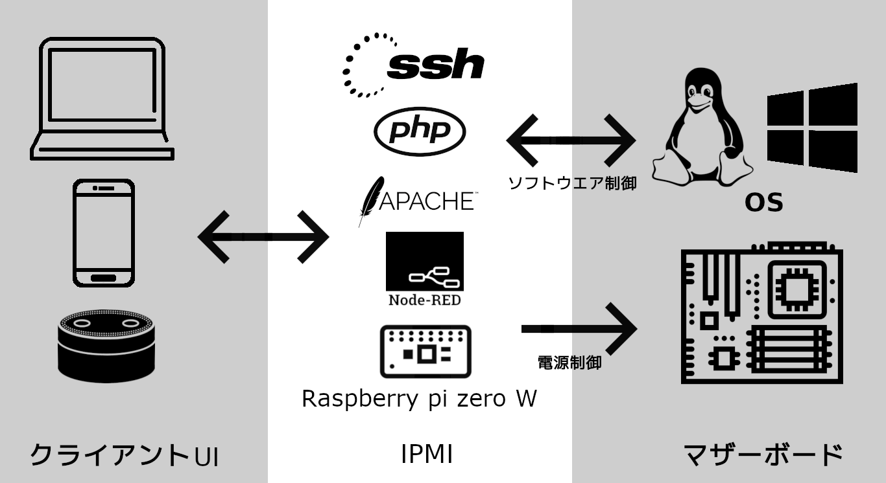
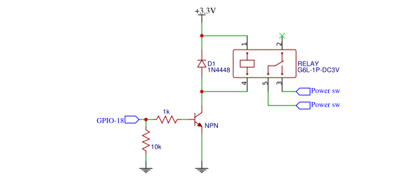

# PC遠隔制御(IPMI)カードの構築
## 1 はじめに
IPMIとはサーバのCPU、バス、ファン、温度センサ、電源、ファンなどの基本コンポーネントの監視や遠隔制御などを行うためのインターフェースである。しかし、市販のIPMIカードは特定のサーバマザーボードにしか対応しない。
本研究では一般ザーボードに対応できるIPMIモジュールを構築する。
## 2 システム構成

図1．システム構成図

- クライアントUI   
クライアントはスマホ、パソコンなどの端末でSSH、又はHttpプロトコルによってサーバーとデータをやり取りする。データの内容はホストPCの電源状態、IPMIモジュールの接続状態、ホストPCに実行させたい命令、命令実行の結果。
- IPMI   
IPMIモジュールはホストPCと独立の電源を使用、マザーボードの電源スイッチを物理的に操作することによって、ホストPCの電源状態と関係なく制御することができる。また、IPMIモジュールはUSBネットワークインタフェースとしてホストPCに接続することで、ホストPCがネットワークに接続しない状態でも遠隔操作ができる。
Apache+Php（ウエブサーバー）でクライアント端末にウエブインタフェースを提供する。スマートスピーカに関する処理はNode-redで行う。
使用可能なインタフェース：SSH,ウエブ
- ホストPC   
ホストPCはSSHプロトコルでIPMIモジュールから命令を受取、命令の実行結果をIPMIモジュールに送る。
## 3 制御インタフェース
### 3.1 ハードウェア制御
#### 3.1.1 電源スイッチ制御回路

図2．電源制御回路図

Raspberry Zero W GPIOの出力電力が低く、直接リレーを制御できないため、NPNトランジスタスイッチ回路リレーを制御する。リレーは電源スイッチと並列に接続する。
#### 3.1.2 電源状態監視回路

図3．電源監視回路図

マザーボードによって、電源を切ったときにも５Vバースに電源が供給される場合があるため。5VバースでホストPCの電源状態を判定できないときは12VバースでホストPCの電源状態を判定する。Raspberry Zeroの最大入力可能電圧は3.3Vのため、直接5v、12Vバースに直接接続せず、NPNトランジスタスイッチ回路で電源状態の判定を行う。
### 3.2 ソフトウェア制御
## 4 UI
- SSH
native terminal   
app   
- Web
desktop layout   
phone layout   
- smart speaker
## opt : 
## 5 まとめ
## 6 参考文献
- Raspberry cpu datasheet
- 